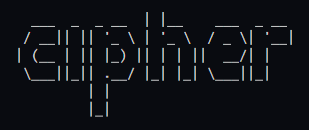
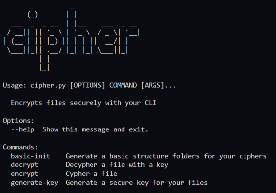
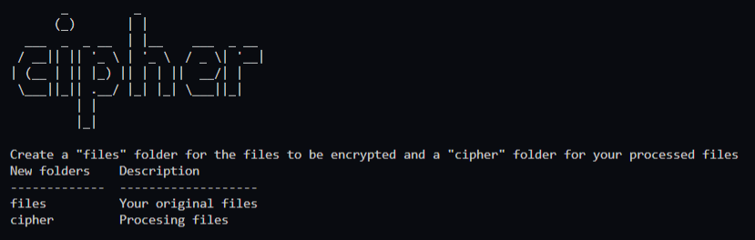
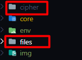
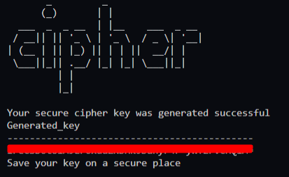
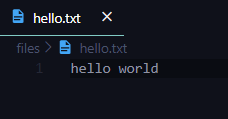
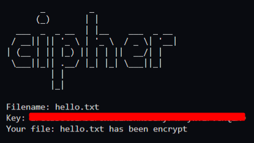
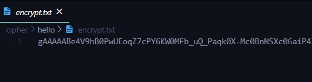
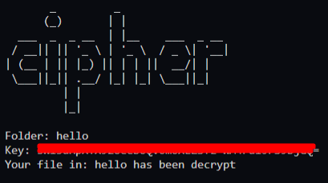
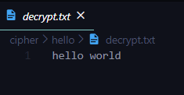

# Cypher (CLI)<!-- omit in toc -->

> Cipher your files made simple

  

## Content<!-- omit in toc -->
- [Features](#features)
- [How to run](#how-to-run)
- [Quick guide](#quick-guide)
  - [Create a basic structure for cipher and decipher](#create-a-basic-structure-for-cipher-and-decipher)
  - [Generate a secure key](#generate-a-secure-key)
  - [Cipher a file](#cipher-a-file)
  - [Decipher a file](#decipher-a-file)
- [How to contribute](#how-to-contribute)

## Features
* Command line interface
* Generate secure keys on [base64](!https://en.wikipedia.org/wiki/Base64)
* Cipher files
* Decipher files

## How to run

* Create enviroment

`python -m venv env`

* Activate enviroment

`cd env/Scripts`
`activate`

* Install requirements

`pip install pycryptodome`

* Execute interface

`python cipher.py`

  

## Quick guide

Only type a simple command for start.

> For this guide I use a simple .txt file with a "hello world" message.

### Create a basic structure for cipher and decipher

`python cipher.py basic-init`

  

When the command is run, two new folders will created, the original files must be placed in the "files" folder.

  

### Generate a secure key

You need a secure key make on base 64 for cipher and decipher your files, type next command:

  

We highly recommend you to store your key in your favorite password manager or in any other secure place.

Move your file to "files" folder.

  

### Cipher a file

Type this:
Type the filename and your generated key.
`python cipher.py encrypt`

  

The generated file is:

  

### Decipher a file

Make sure you have a folder with an `encrypt.txt` file.

Type this:
``python cipher.py decrypt``

  

Your file:

  

# How to contribute
Send me a pull request or contact me as eocode in social media.

# License
GNU General Public License v3.0